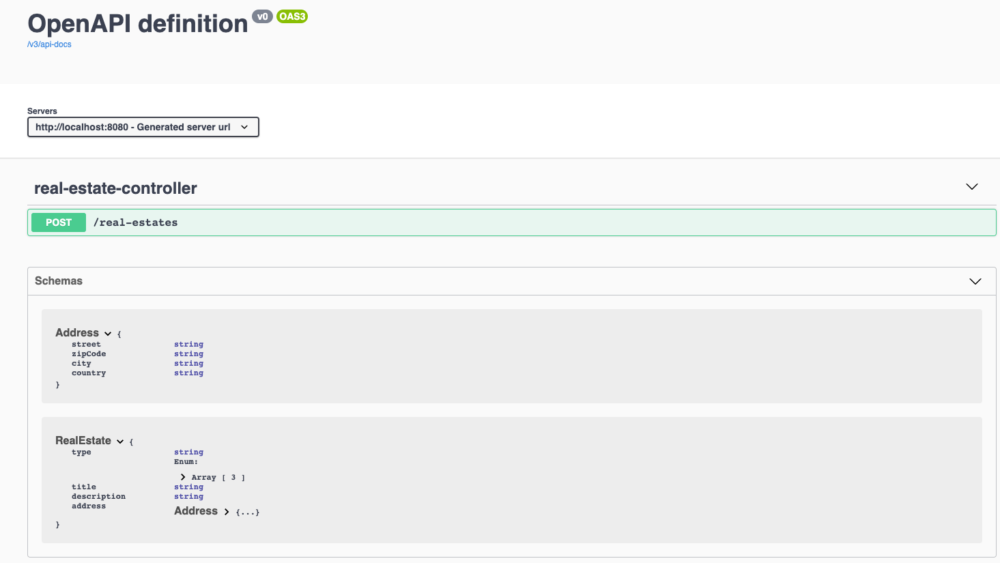

# Ezloc project
Service de gestion des biens immobiliers

## Comment utiliser ce projet ?

### 1 - Récupérer le projet en local

```sh
git clone https://github.com/ntdtfr/ezloc
```

### 2 - Exécuter l'application

Positionnez-vous dans le dossier du projet et utilisez l'une des deux options d'exécution suivante:


* Avec `Maven`

```sh
mvn spring-boot:run
```

* Avec `Docker Compose`

```sh
docker-compose up --build ezloc
```

L'interface de `Swagger` est accessible via l'url : http://localhost:8080/swagger-ui.html




## Comment contribuer à ce projet ?


